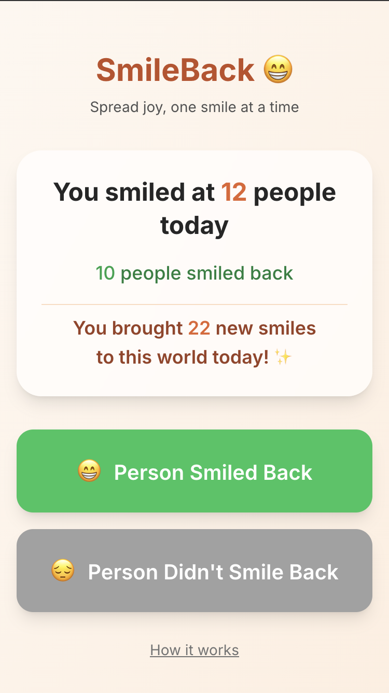

# SmileBack 😊

A simple web app to track your daily smiles and the positive impact you have on others.



## What is SmileBack?

SmileBack helps you:
- Track how many people you smile at each day
- Record whether people smile back at you
- See your positive impact: total new smiles you've brought to the world
- Build a habit of spreading joy and kindness

## How it works

1. **Smile at someone** in real life
2. **Open the app** and record the interaction:
   - Tap "Person Smiled Back" if they returned your smile
   - Tap "Person Didn't Smile Back" if they didn't respond
3. **Watch your impact grow** - see how many new smiles you've created today

## Why track smiles?

- **Builds awareness** of your positive interactions
- **Encourages more smiling** by gamifying kindness  
- **Shows your impact** - every smile you give creates new positivity
- **Creates a positive feedback loop** that brightens your day

## Development

Built with:
- React 19 + TypeScript
- Vite for fast development
- TailwindCSS v4 for styling
- PostHog for analytics
- Local storage for data persistence

### Getting Started

```bash
bun install
bun dev
```

### Building

```bash
bun run build
```

## Privacy

All smile data is stored locally on your device. Only anonymous analytics events are sent to help improve the app.
